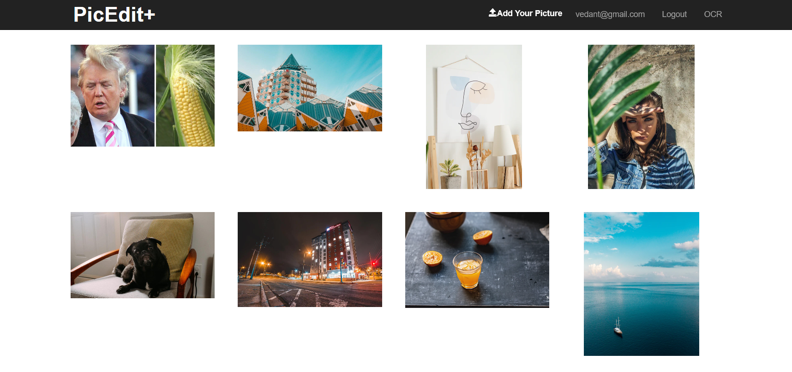

# PhotoEdit
PhotoEdit is an Angular web app built as a final project in Spring 2020 for the course INFO 6150 -- Web Design and User Experience Engineering. 

## Technologies/Frameworks Used

Frontend: Angular 8

Backend: Express, Nodejs  

Database: MongoDB

Style: SASS, CSS, Bootstrap, Angular Material

Authentication/Authorization: JWT, bcrypt

External APIs connected to the app: Gmail for sending mails, Imgur for image uploading, Google Cloud Vision API for Optical Character Recognition, Nexmo API to send OTP to users on their phones

## Screenshot

## User Stories:
1. User can sign up by providing the Username, Email, Password and Phone Number (optional) 
2. Login 
* Login with the Username and Password OR
* With the OTP sent to the number provided at the time of registration
3. User can reset the password by entering the verified code sent by email
4. Add a new picture to edit 
5. Save that newly edited photo to the server, download it onto their local systems or share it with their friends through email
6. View all photos saved in the cloud (read imgur) 
7. Click the photo to edit or delete
8. Users can use OCR service to extract text from images. This feature doesn't require a login

## APi Endpoints:
Users 
1. GET /users
2. POST /users/authentication
3. POSt /users/registration
4. PUT /users/:username
5. PUT /users/reset/:account

Images 
1. GET /users/images 
2. GET /users/:userName/images 
3. POST /users/:userName/images
4. PUT /users/:userName/images
5. DELETE /users/:userName/images

Email 
1. POST /users/:userName/sendMail

Message 
1. POST /users/:userName/sendMessage

OCR 
1. POST /getOCR 

## Running the project: 
* Pre-requisites: 
1. Ensure MongoDB is installed and running

* Steps
1. Clone or download the repository
2. Enter the server folder and webapp folder, then input "npm install" to install all the dependecies
5. Use command "node server.js" in "server" folder to start the server
6. Use command "ng serve" in "webapp" folder to start the front-end
7. App is hosted at http://localhost:4200

## Contributors: 
1. Vedant Deokar - deokar.v@husky.neu.edu
2. Zeyu Shen - shen.zey@husky.neu.edu
3. Yiwei He - he.yiw@husky.neu.edu
4. Yuan Lian - 

## License
[MIT License](https://opensource.org/licenses/MIT)
